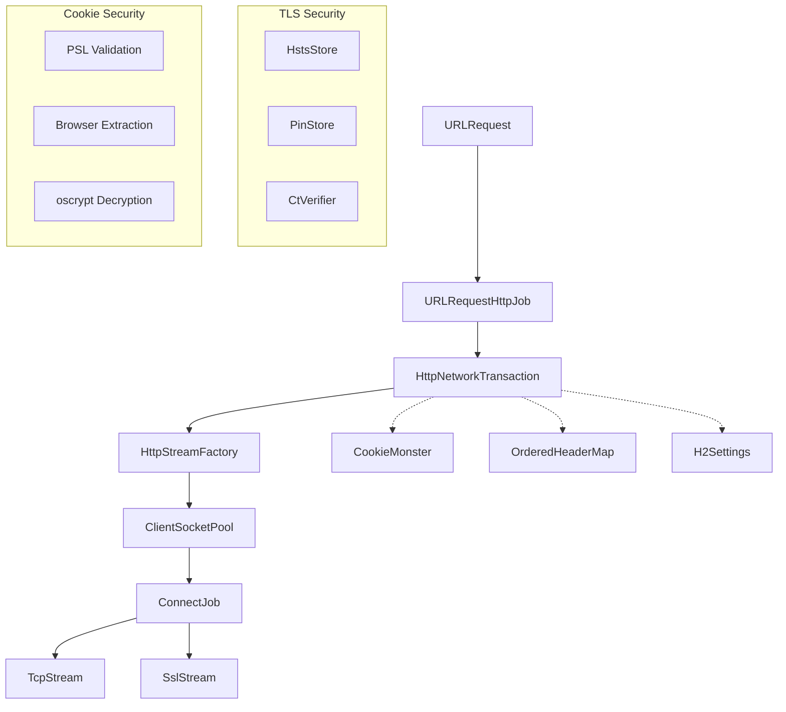

# Chromenet Architecture

## Overview
`chromenet` is a Rust port of Chromium's network stack (`//net`), designed for browser-like HTTP requests with TLS fingerprinting matching.

**Stats:** ~6,000 LOC | 112 tests | 9 benchmarks

## Modules

| Module | Files | Purpose |
|--------|-------|---------|
| [base](base.md) | 2 | Error codes, load states |
| [cookies](cookies.md) | 7 | Cookie storage, parsing, PSL, browser extraction |
| [http](http.md) | 9 | Transaction, streams, headers, H2 fingerprinting |
| [socket](socket.md) | 8 | Pool, connect job, TLS, proxy, auth cache |
| [tls](tls.md) | 4 | HSTS, certificate pinning, CT verification |
| [urlrequest](urlrequest.md) | 5 | Public API, redirect handling, device emulation |

## Request Flow

1. **URLRequest** - User-facing API, parses URL
2. **URLRequestHttpJob** - Manages redirects (max 20), strips auth on cross-origin
3. **HttpNetworkTransaction** - State machine: CreateStream → SendRequest → ReadHeaders
4. **HttpStreamFactory** - Negotiates H1/H2 based on ALPN, H2 session caching
5. **ClientSocketPool** - Enforces limits (6/host, 256 total)
6. **ConnectJob** - DNS → TCP → (Proxy CONNECT) → TLS

## Security Features

| Feature | Module | Description |
|---------|--------|-------------|
| HSTS Preload | `tls/hsts` | Force HTTPS for known domains |
| Certificate Pinning | `tls/pinning` | SPKI hash verification |
| PSL Validation | `cookies/psl` | Prevent supercookie attacks |
| Credential Stripping | `urlrequest/job` | CVE-2014-1829 fix |
| Redirect Limits | `urlrequest/job` | Max 20 redirects |

## Chromium Mapping

| Chromium C++ | Rust | File |
|--------------|------|------|
| `net::URLRequest` | `URLRequest` | urlrequest/request.rs |
| `net::URLRequestHttpJob` | `URLRequestHttpJob` | urlrequest/job.rs |
| `net::HttpNetworkTransaction` | `HttpNetworkTransaction` | http/transaction.rs |
| `net::HttpStreamFactory` | `HttpStreamFactory` | http/streamfactory.rs |
| `net::ClientSocketPool` | `ClientSocketPool` | socket/pool.rs |
| `net::ConnectJob` | `ConnectJob` | socket/connectjob.rs |
| `net::CookieMonster` | `CookieMonster` | cookies/monster.rs |
| `net::TransportSecurityState` | `HstsStore` | tls/hsts.rs |
| `net::HttpAuthCache` | `AuthCache` | socket/authcache.rs |
