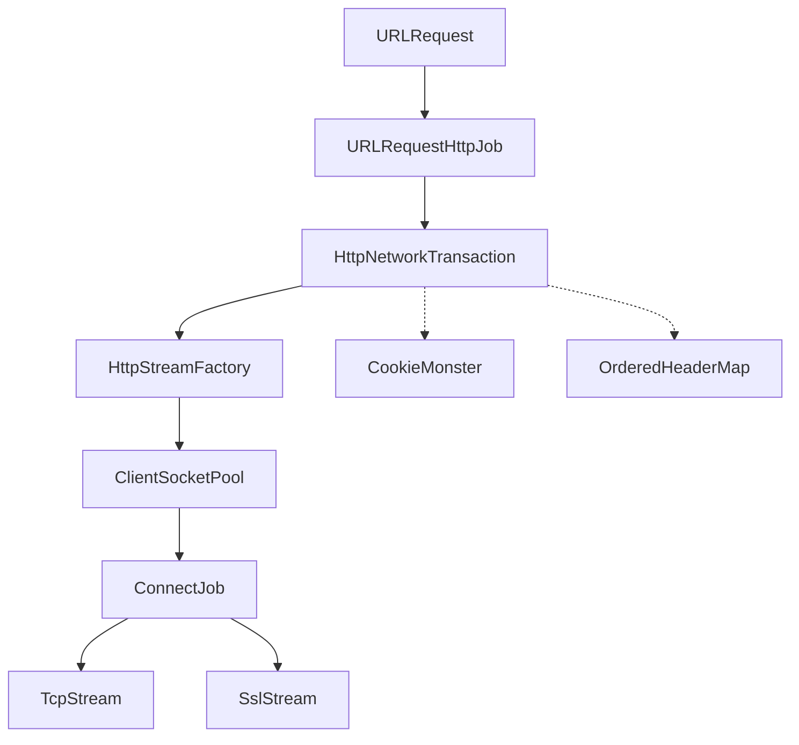

# Chromenet Architecture

## Overview
`chromenet` is a Rust port of Chromium's network stack (`//net`), designed for browser-like HTTP requests with TLS fingerprinting matching.

## Modules

| Module | Files | Purpose |
|--------|-------|---------|
| [base](file:///home/ubuntu/projects/chromium/dl/chromenet/docs/base.md) | 2 | Error codes, load states |
| [cookies](file:///home/ubuntu/projects/chromium/dl/chromenet/docs/cookies.md) | 2 | Cookie storage & parsing |
| [http](file:///home/ubuntu/projects/chromium/dl/chromenet/docs/http.md) | 3 | Transaction, streams, headers |
| [socket](file:///home/ubuntu/projects/chromium/dl/chromenet/docs/socket.md) | 5 | Pool, connect job, TLS, proxy |
| [urlrequest](file:///home/ubuntu/projects/chromium/dl/chromenet/docs/urlrequest.md) | 3 | Public API, redirect handling |

## Request Flow

1. **URLRequest** - User-facing API, parses URL
2. **URLRequestHttpJob** - Manages redirects (max 20), strips auth on cross-origin
3. **HttpNetworkTransaction** - State machine: CreateStream → SendRequest → ReadHeaders
4. **HttpStreamFactory** - Negotiates H1/H2 based on ALPN
5. **ClientSocketPool** - Enforces limits (6/host, 256 total)
6. **ConnectJob** - DNS → TCP → (Proxy CONNECT) → TLS

## Chromium Mapping

| Chromium C++ | Rust | File |
|--------------|------|------|
| `net::URLRequest` | `URLRequest` | [request.rs](file:///home/ubuntu/projects/chromium/dl/chromenet/src/urlrequest/request.rs) |
| `net::URLRequestHttpJob` | `URLRequestHttpJob` | [job.rs](file:///home/ubuntu/projects/chromium/dl/chromenet/src/urlrequest/job.rs) |
| `net::HttpNetworkTransaction` | `HttpNetworkTransaction` | [transaction.rs](file:///home/ubuntu/projects/chromium/dl/chromenet/src/http/transaction.rs) |
| `net::HttpStreamFactory` | `HttpStreamFactory` | [streamfactory.rs](file:///home/ubuntu/projects/chromium/dl/chromenet/src/http/streamfactory.rs) |
| `net::ClientSocketPool` | `ClientSocketPool` | [pool.rs](file:///home/ubuntu/projects/chromium/dl/chromenet/src/socket/pool.rs) |
| `net::ConnectJob` | `ConnectJob` | [connectjob.rs](file:///home/ubuntu/projects/chromium/dl/chromenet/src/socket/connectjob.rs) |
| `net::CookieMonster` | `CookieMonster` | [monster.rs](file:///home/ubuntu/projects/chromium/dl/chromenet/src/cookies/monster.rs) |
