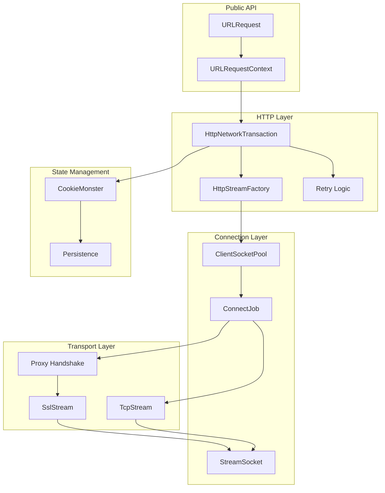
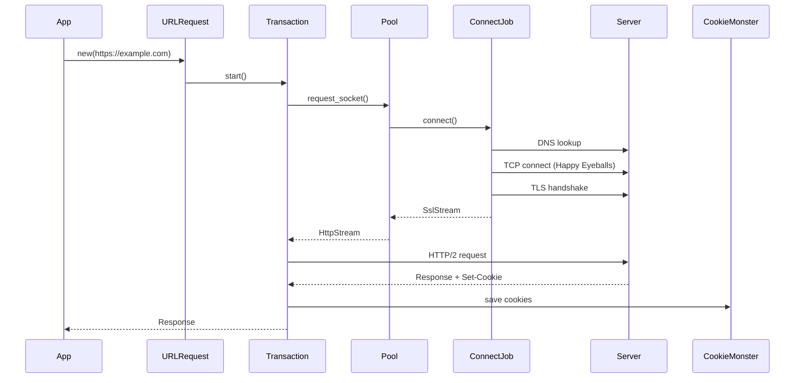
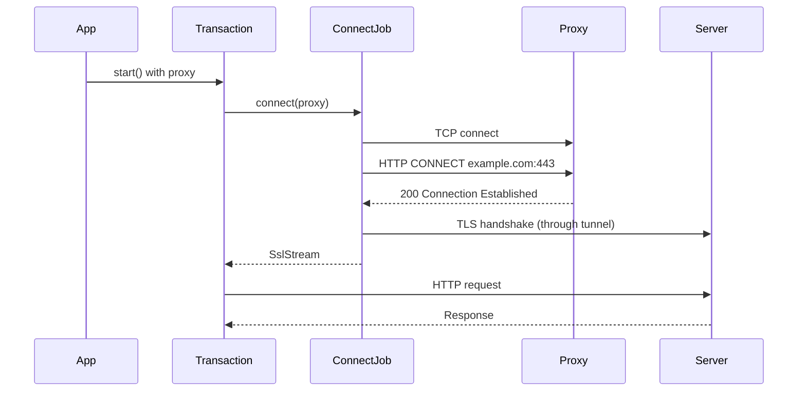
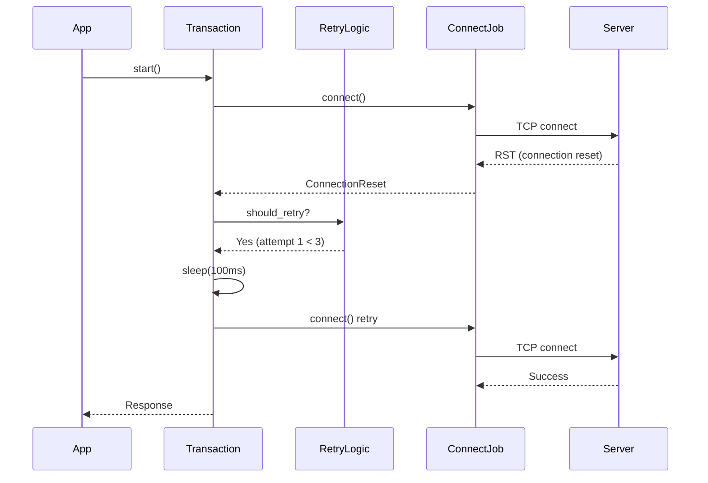
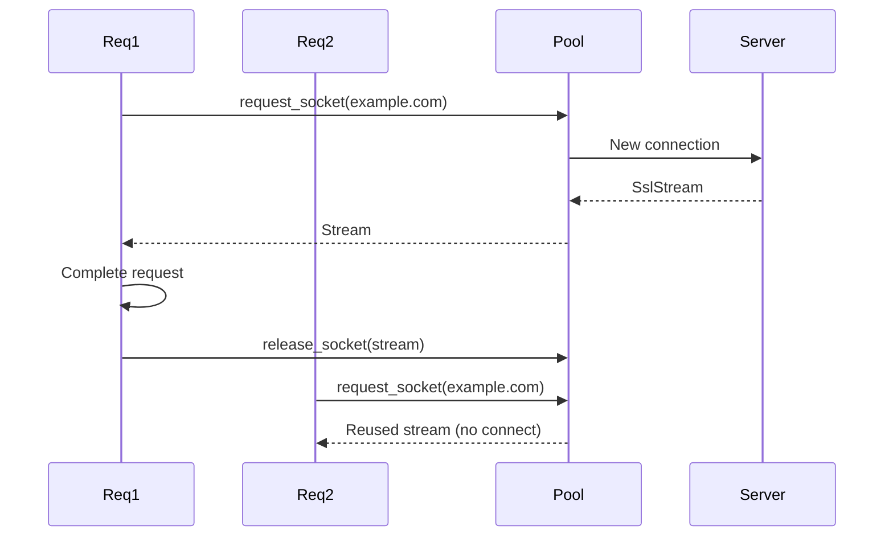
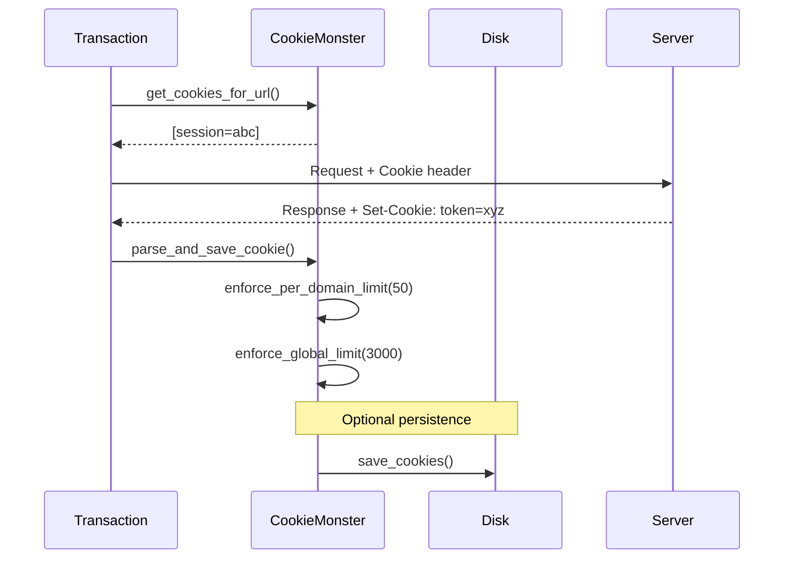

# Chromenet Codemap

Complete flow diagrams and scenarios for the chromenet library.

## High-Level Architecture

---

## Scenario 1: Simple HTTPS Request

---

## Scenario 2: Request with HTTP Proxy

---

## Scenario 3: Connection Retry with Backoff

---

## Scenario 4: Socket Pool Reuse

---

## Scenario 5: Cookie Flow

---

## File Map

| Module | Files | Responsibility |
|--------|-------|----------------|
| `urlrequest` | request.rs, job.rs, context.rs, device.rs | Public API |
| `http` | transaction.rs, streamfactory.rs, retry.rs | HTTP/1.1 & H2 |
| `socket` | pool.rs, connectjob.rs, stream.rs, tls.rs, proxy.rs | Connections |
| `cookies` | monster.rs, canonical_cookie.rs, persistence.rs | Cookie state |
| `base` | neterror.rs, loadstate.rs | Common types |
