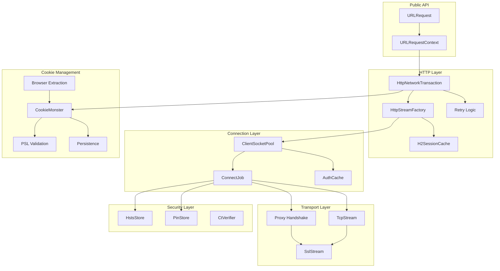
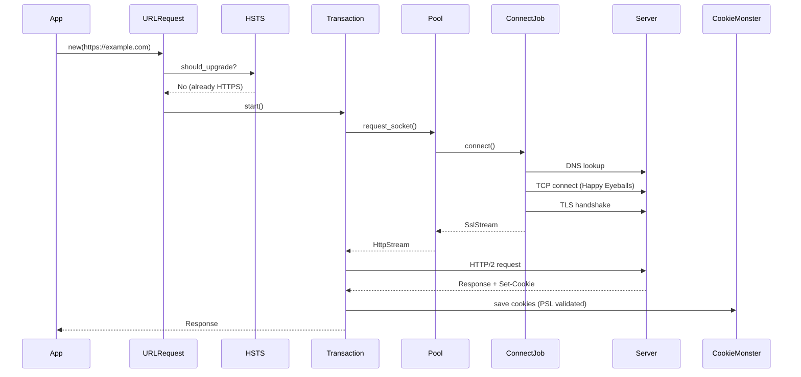
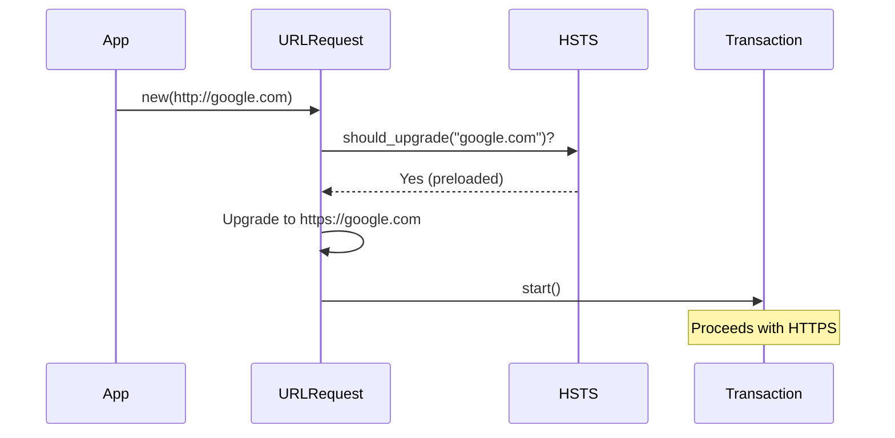
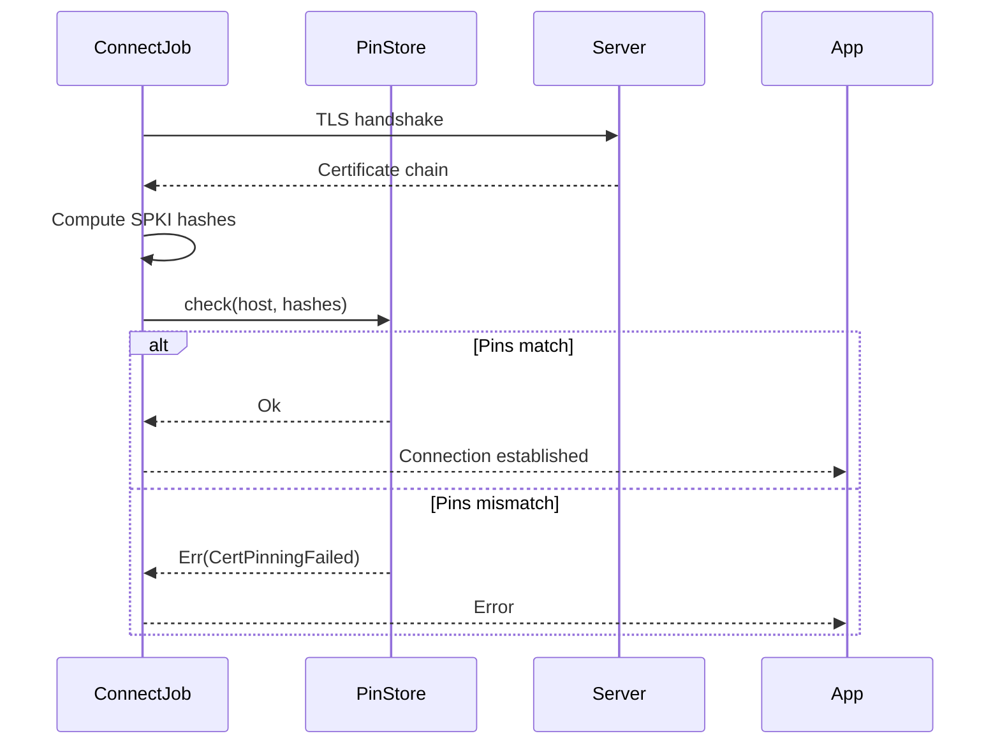
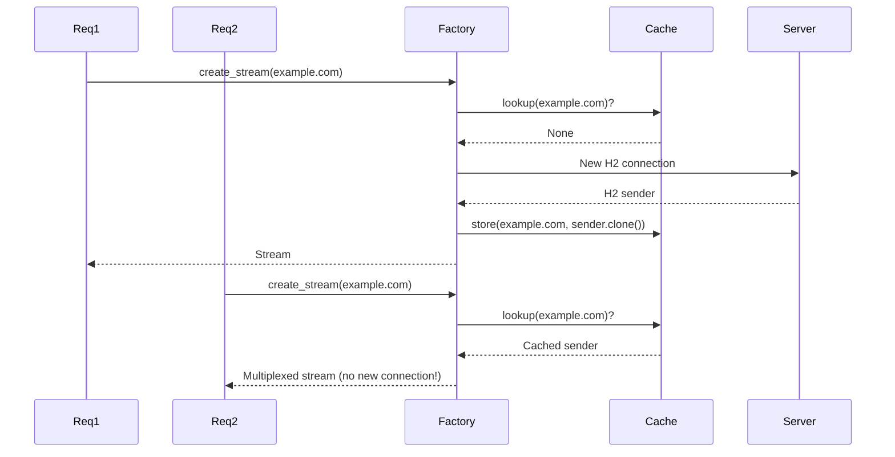

# Chromenet Codemap

Complete flow diagrams and scenarios for the chromenet library.

**Stats:** ~6,000 LOC | 112 tests | 9 benchmarks | 4 examples

## High-Level Architecture



---

## Scenario 1: Simple HTTPS Request



---

## Scenario 2: HSTS Upgrade



---

## Scenario 3: Certificate Pinning



---

## Scenario 4: H2 Multiplexing



---

## Scenario 5: Cookie with PSL Validation

```mermaid
sequenceDiagram
    participant Server
    participant Transaction
    participant CookieMonster
    participant PSL

    Server-->>Transaction: Set-Cookie: session=abc; Domain=.com
    Transaction->>CookieMonster: parse_and_save_cookie()
    CookieMonster->>PSL: is_public_suffix(".com")?
    PSL-->>CookieMonster: Yes (public suffix!)
    CookieMonster-->>Transaction: Cookie REJECTED (supercookie attack)
```

---

## File Map

| Module | Files | Responsibility |
|--------|-------|----------------|
| `urlrequest` | request.rs, job.rs, context.rs, device.rs | Public API |
| `http` | transaction.rs, streamfactory.rs, retry.rs, h2settings.rs, orderedheaders.rs | HTTP/1.1 & H2 |
| `socket` | pool.rs, connectjob.rs, stream.rs, tls.rs, proxy.rs, authcache.rs | Connections |
| `cookies` | monster.rs, canonical_cookie.rs, persistence.rs, psl.rs, browser.rs, oscrypt.rs | Cookie state |
| `tls` | hsts.rs, pinning.rs, ct.rs | Security |
| `base` | neterror.rs, loadstate.rs | Common types |

---

## Test Coverage

| Module | Unit Tests | Integration Tests |
|--------|------------|-------------------|
| cookies | 17 | 6 (psl_test) |
| http | 20 | - |
| socket | 7 | 6 (authcache_test) |
| tls | 21 | 12 (hsts_test, pinning_test) |
| urlrequest | 9 | - |
| **Total** | **88** | **24** |
