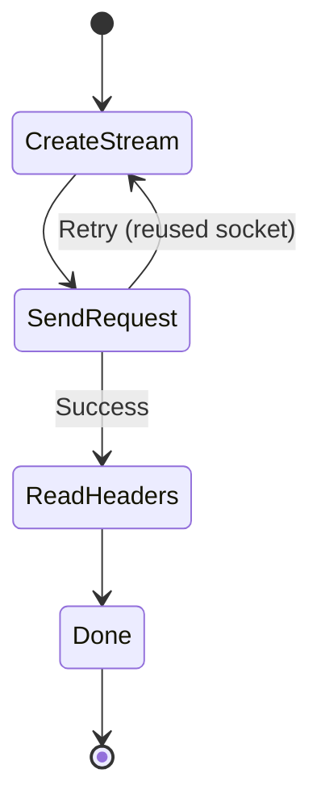

# HTTP Module

## Files
| File | Lines | Purpose |
|------|-------|---------|
| [transaction.rs](../src/http/transaction.rs) | ~230 | Request/response state machine |
| [streamfactory.rs](../src/http/streamfactory.rs) | ~200 | Stream creation + H2 caching |
| [orderedheaders.rs](../src/http/orderedheaders.rs) | ~60 | Order-preserving headers |
| [retry.rs](../src/http/retry.rs) | ~155 | Exponential backoff |
| [h2settings.rs](../src/http/h2settings.rs) | ~90 | HTTP/2 fingerprinting (NEW) |
| [requestbody.rs](../src/http/requestbody.rs) | ~55 | Request body handling |
| [response.rs](../src/http/response.rs) | ~80 | Response wrapper |

---

## HttpNetworkTransaction

State machine for HTTP request/response lifecycle.



### Features
- **Automatic retry** with exponential backoff (max 3 attempts)
- Auto-retry on reused socket failure
- Cookie storage from `Set-Cookie` headers
- H1/H2 protocol selection via ALPN
- **H2 SETTINGS fingerprinting** (NEW)
- **Device emulation** (NEW)

---

## H2Settings (NEW)

HTTP/2 SETTINGS frame configuration for browser fingerprinting.

```rust
use chromenet::http::H2Settings;

// Use browser presets
let chrome = H2Settings::chrome();
let firefox = H2Settings::firefox();
let safari = H2Settings::safari();

// Custom settings
let custom = H2Settings {
    header_table_size: 65536,
    enable_push: false,
    max_concurrent_streams: 100,
    initial_window_size: 6291456,
    max_frame_size: 16384,
    max_header_list_size: 262144,
};
```

### Browser Fingerprints
| Setting | Chrome | Firefox | Safari |
|---------|--------|---------|--------|
| initial_window_size | 6,291,456 | 131,072 | 4,194,304 |
| max_concurrent_streams | 1000 | 100 | 100 |
| max_frame_size | 16,384 | 16,384 | 16,384 |
| header_table_size | 65,536 | 65,536 | 65,536 |

---

## HttpStreamFactory

Creates HTTP streams from pooled sockets with **H2 session caching**.

### H2 Multiplexing (NEW)
```rust
// First request: creates new H2 connection, caches sender
let stream1 = factory.create_stream(&url, None, None).await?;

// Second request: reuses cached H2 sender (multiplexing!)
let stream2 = factory.create_stream(&url, None, None).await?;
```

### Protocol Detection
```rust
let is_h2 = matches!(ssl_stream.ssl().selected_alpn_protocol(), Some(b"h2"));
```

---

## Retry Module

Exponential backoff retry logic based on Chromium's `HttpNetworkTransaction`.

### RetryReason (retryable errors)
| Error | Description |
|-------|-------------|
| ConnectionReset | TCP RST received |
| ConnectionClosed | TCP FIN received |
| EmptyResponse | No data from server |
| SocketNotConnected | Socket disconnected |
| HttpRequestTimeout | Request timed out |

### RetryConfig
```rust
RetryConfig {
    max_attempts: 3,      // Chromium default
    base_delay_ms: 100,   // 100ms initial backoff
    max_delay_ms: 5000,   // Cap at 5 seconds
    jitter_factor: 0.1,   // ±10% jitter
}
```

---

## OrderedHeaderMap

Header map preserving insertion order for fingerprinting.

```rust
pub struct OrderedHeaderMap {
    headers: Vec<(HeaderName, HeaderValue)>,
}
```

### Methods
| Method | Behavior |
|--------|----------|
| `insert` | Update in-place or append |
| `remove` | Filter by name |
| `get` | First match |
| `to_header_map` | Convert to `http::HeaderMap` |

> [!TIP]
> Header names are automatically lowercased by `HeaderName::from_str()`.
