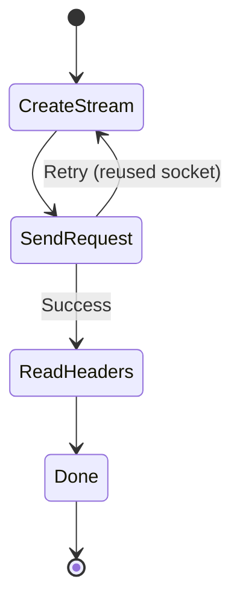

# HTTP Module

## Files
- [transaction.rs](file:///home/ubuntu/projects/chromium/dl/chromenet/src/http/transaction.rs) (158 lines)
- [streamfactory.rs](file:///home/ubuntu/projects/chromium/dl/chromenet/src/http/streamfactory.rs) (140 lines)
- [orderedheaders.rs](file:///home/ubuntu/projects/chromium/dl/chromenet/src/http/orderedheaders.rs) (58 lines)

---

## HttpNetworkTransaction

State machine for HTTP request/response lifecycle.



### Features
- Auto-retry on reused socket failure
- Cookie storage from `Set-Cookie` headers
- H1/H2 protocol selection via ALPN

---

## HttpStreamFactory

Creates HTTP streams from pooled sockets.

### Protocol Detection
```rust
let is_h2 = matches!(ssl_stream.ssl().selected_alpn_protocol(), Some(b"h2"));
```

### Stream Types
```rust
enum HttpStreamInner {
    H1(http1::SendRequest<...>),
    H2(http2::SendRequest<...>),
}
```

---

## OrderedHeaderMap

Header map preserving insertion order for fingerprinting.

```rust
pub struct OrderedHeaderMap {
    headers: Vec<(HeaderName, HeaderValue)>,
}
```

### Methods
| Method | Behavior |
|--------|----------|
| `insert` | Update in-place or append |
| `remove` | Filter by name |
| `get` | First match |
| `to_header_map` | Convert to `http::HeaderMap` |

> [!TIP]
> Header names are automatically lowercased by `HeaderName::from_str()`.
