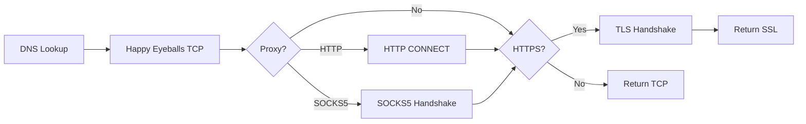

# Socket Module

## Files
- [pool.rs](file:///home/ubuntu/projects/chromium/dl/chromenet/src/socket/pool.rs) (~420 lines)
- [connectjob.rs](file:///home/ubuntu/projects/chromium/dl/chromenet/src/socket/connectjob.rs) (~315 lines)
- [tls.rs](file:///home/ubuntu/projects/chromium/dl/chromenet/src/socket/tls.rs) (~100 lines)
- [proxy.rs](file:///home/ubuntu/projects/chromium/dl/chromenet/src/socket/proxy.rs) (49 lines)
- [client.rs](file:///home/ubuntu/projects/chromium/dl/chromenet/src/socket/client.rs) (~100 lines)

---

## ClientSocketPool

Manages connection pooling with Chromium-like limits and **request queuing**.

### Features
| Feature | Description |
|---------|-------------|
| Request Queuing | Pending requests queue instead of failing |
| Priority Queue | Higher priority requests served first |
| Idle Socket Cleanup | Background task prunes stale sockets |

### Limits
| Limit | Default | Chromium |
|-------|---------|----------|
| Per-host | 6 | 6 |
| Total | 256 | 256 |

### Idle Timeouts (Chromium defaults)
| Type | Timeout |
|------|---------|
| Used sockets | 5 minutes |
| Unused sockets | 10 seconds |

### Key Methods
```rust
request_socket_with_priority(url, proxy, priority)
release_socket(url, socket)
cleanup_idle_sockets()
start_cleanup_task()  // Background cleanup every 60s
```

---

## ConnectJob

Handles DNS → TCP → (Proxy) → TLS pipeline with **Happy Eyeballs** and **SOCKS5**.

### Happy Eyeballs (RFC 8305)
- IPv6 attempted first
- IPv4 starts after 250ms delay
- First successful connection wins

### Connection Timeout
- 4 minutes (matches Chromium)

### Proxy Support
| Type | Status |
|------|--------|
| HTTP CONNECT | ✅ Implemented |
| SOCKS5 | ✅ Implemented (RFC 1928) |
| HTTPS | ⏳ Not implemented |

### Flow


---

## TlsConfig

BoringSSL configuration matching Chrome's TLS fingerprint.

```rust
pub struct TlsConfig {
    pub min_version: Option<SslVersion>,  // TLS 1.2
    pub max_version: Option<SslVersion>,  // TLS 1.3
    pub cipher_list: String,              // Chrome cipher suite
    pub alpn_protos: Vec<String>,         // ["h2", "http/1.1"]
    pub curves: Vec<String>,              // ["X25519", "P-256", "P-384"]
    pub sigalgs: String,                  // Signature algorithms
    pub enable_grease: bool,
}
```

---

## SocketType

Unified socket wrapper with **real health checks**.

```rust
pub enum SocketType {
    Tcp(tokio::net::TcpStream),
    Ssl(tokio_boring::SslStream<TcpStream>),
}

impl StreamSocket for SocketType {
    fn is_connected(&self) -> bool;        // Uses try_read()
    fn is_connected_and_idle(&self) -> bool;
}
```
