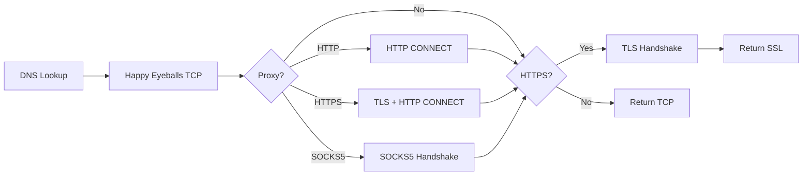

# Socket Module

## Files
| File | Lines | Purpose |
|------|-------|---------|
| [pool.rs](../src/socket/pool.rs) | ~420 | Connection pooling |
| [connectjob.rs](../src/socket/connectjob.rs) | ~315 | Connection establishment |
| [tls.rs](../src/socket/tls.rs) | ~100 | TLS configuration |
| [proxy.rs](../src/socket/proxy.rs) | ~50 | Proxy settings |
| [client.rs](../src/socket/client.rs) | ~100 | Client socket wrapper |
| [stream.rs](../src/socket/stream.rs) | ~80 | Stream abstractions |
| [authcache.rs](../src/socket/authcache.rs) | ~190 | Auth credential cache (NEW) |

---

## ClientSocketPool

Manages connection pooling with Chromium-like limits and **request queuing**.

### Features
| Feature | Description |
|---------|-------------|
| Request Queuing | Pending requests queue instead of failing |
| Priority Queue | Higher priority requests served first |
| Idle Socket Cleanup | Background task prunes stale sockets |
| **H2 Multiplexing** | Reuse HTTP/2 connections (NEW) |

### Limits
| Limit | Default | Chromium |
|-------|---------|----------|
| Per-host | 6 | 6 |
| Total | 256 | 256 |

### Idle Timeouts (Chromium defaults)
| Type | Timeout |
|------|---------|
| Used sockets | 5 minutes |
| Unused sockets | 10 seconds |

---

## ConnectJob

Handles DNS → TCP → (Proxy) → TLS pipeline with **Happy Eyeballs** and **SOCKS5**.

### Happy Eyeballs (RFC 8305)
- IPv6 attempted first
- IPv4 starts after 250ms delay
- First successful connection wins

### Connection Timeout
- 4 minutes (matches Chromium)

### Proxy Support
| Type | Status |
|------|--------|
| HTTP CONNECT | ✅ Implemented |
| HTTPS CONNECT | ✅ TLS-in-TLS |
| SOCKS5 | ✅ RFC 1928 |

### Flow


---

## AuthCache (NEW)

Cache proxy authentication credentials to avoid re-prompting.

```rust
use chromenet::socket::authcache::{AuthCache, AuthEntry};

let cache = AuthCache::new();

// Store credentials
cache.store("proxy.com", 8080, "MyRealm", 
    AuthEntry::basic("MyRealm", "user", "pass"));

// Lookup for subsequent requests
if let Some(entry) = cache.lookup("proxy.com", 8080, "MyRealm") {
    let header = entry.to_header_value(); // "Basic dXNlcjpwYXNz"
}
```

### Supported Schemes
| Scheme | Status |
|--------|--------|
| Basic | ✅ Implemented |
| Digest | ⚙️ Stub |
| NTLM | ⚙️ Stub |

---

## TlsConfig

BoringSSL configuration matching Chrome's TLS fingerprint.

```rust
pub struct TlsConfig {
    pub min_version: Option<SslVersion>,  // TLS 1.2
    pub max_version: Option<SslVersion>,  // TLS 1.3
    pub cipher_list: String,              // Chrome cipher suite
    pub alpn_protos: Vec<String>,         // ["h2", "http/1.1"]
    pub curves: Vec<String>,              // ["X25519", "P-256", "P-384"]
    pub sigalgs: String,                  // Signature algorithms
    pub enable_grease: bool,
}
```

---

## StreamSocket Trait

Enables TLS-in-TLS and polymorphic socket handling.

```rust
pub trait StreamSocket: AsyncRead + AsyncWrite + Unpin + Send + 'static {}

impl StreamSocket for TcpStream {}
impl<S: StreamSocket> StreamSocket for SslStream<S> {}
```

### BoxedSocket

Type-erased socket wrapper for dynamic dispatch:

```rust
pub struct BoxedSocket {
    inner: Pin<Box<dyn StreamSocket>>,
}
```
