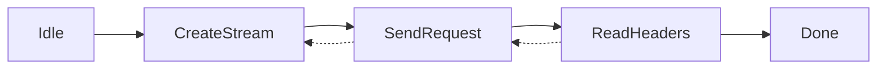
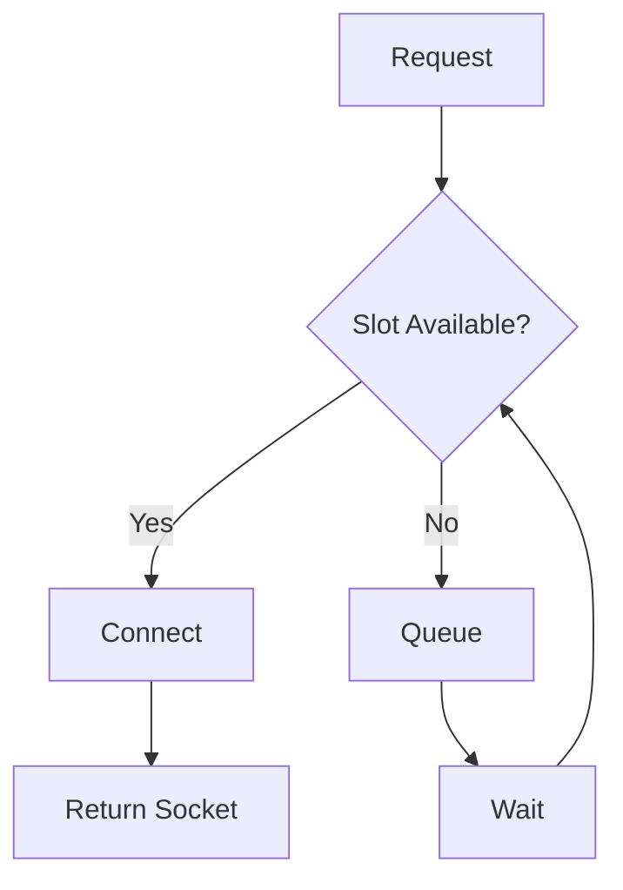

# chromenet Static Analysis Findings

## Summary

| Category | Count | Severity |
|----------|-------|----------|
| TODOs | 2 | Medium |
| Debug logging (eprintln) | 10 | Low |
| Unwraps in production | ~5 | Medium |
| Missing error context | 8 | Low |
| Missing features | 5 | High |

---

## Critical: Incomplete Implementations

### 1. CT Verification Stub
**File:** [ctverifier.rs:159](file:///home/ubuntu/projects/gdlraw/chromenet/src/tls/ctverifier.rs#L159)
```rust
// TODO: Implement full ECDSA signature verification using boring crate
```
**Chromium:** `net/cert/ct_ev_whitelist.cc`, `net/cert/ct_verify_result.cc`

**Impact:** Certificate Transparency is not fully validated.

---

### 2. Cookie Memory Performance
**File:** [browser.rs:443](file:///home/ubuntu/projects/gdlraw/chromenet/src/cookies/browser.rs#L443)
```rust
// TODO(performance): accessing all rows loads all cookies into memory.
```
**Chromium:** Uses lazy loading with sqlite cursors.

**Impact:** Large cookie DBs may cause high memory usage.

---

## High: Missing Features

| Feature | Chromium | chromenet | Notes |
|---------|----------|-----------|-------|
| Cache | `net/http/http_cache.h` | ❌ Missing | No HTTP caching |
| Streaming body | `net/base/upload_data_stream.h` | ⚠️ Partial | Only Empty body support |
| QUIC/HTTP3 | `net/quic/` | ❌ Missing | H3 not implemented |
| Proxy PAC | `net/proxy_resolution/` | ❌ Missing | No PAC file support |
| HSTS persistence | `TransportSecurityPersister` | ❌ Missing | Memory only |

---

## Medium: Debug Logging

Production code uses `eprintln!` for debugging:

| File | Line | Issue |
|------|------|-------|
| [connectjob.rs:264](file:///home/ubuntu/projects/gdlraw/chromenet/src/socket/connectjob.rs#L264) | SSL handshake debug |
| [connectjob.rs:296](file:///home/ubuntu/projects/gdlraw/chromenet/src/socket/connectjob.rs#L296) | TLS-in-TLS debug |
| [connectjob.rs:371](file:///home/ubuntu/projects/gdlraw/chromenet/src/socket/connectjob.rs#L371) | Proxy tunnel debug |
| [transaction.rs:219](file:///home/ubuntu/projects/gdlraw/chromenet/src/http/transaction.rs#L219) | Transaction debug |
| [streamfactory.rs:43](file:///home/ubuntu/projects/gdlraw/chromenet/src/http/streamfactory.rs#L43) | H1 request error |
| [streamfactory.rs:151](file:///home/ubuntu/projects/gdlraw/chromenet/src/http/streamfactory.rs#L151) | H2 handshake error |

**Recommendation:** Replace with `tracing` crate or conditional logging.

---

## Medium: Missing Error Context

| Location | Issue | Fix |
|----------|-------|-----|
| `pool.rs:221` | `ConnectionFailed` without host | Use `ConnectionFailedTo` |
| `streamfactory.rs:43` | Raw `ConnectionClosed` | Add request context |
| `streamfactory.rs:151` | Raw `ConnectionFailed` | Add H2 handshake context |
| `transaction.rs` | Some generic errors | Add URL context |

---

## Low: Code Quality

### Unwraps in Production Code
Most unwraps are in tests, but these are notable:
- `digestauth.rs:311` - Format write (safe)
- `monster.rs:263` - Logs parse error (non-fatal)

### Missing `#[must_use]`
Public functions could benefit from `#[must_use]`:
- `request_socket()` - Result should be used
- `create_stream()` - Result should be used

---

## Control Flow Analysis

### State Machine: HttpNetworkTransaction

**Status:** ✅ Complete. Retry logic handles B ← C ← D transitions.

### Connection Pool

**Status:** ✅ Complete. Limits enforced (6/host, 256 total).

---

## Next Steps

| Priority | Task | Effort |
|----------|------|--------|
| 1 | Implement CT verification | Medium |
| 2 | Add HTTP cache | High |
| 3 | Replace eprintln with tracing | Low |
| 4 | Add streaming body support | Medium |
| 5 | HSTS persistence | Medium |
